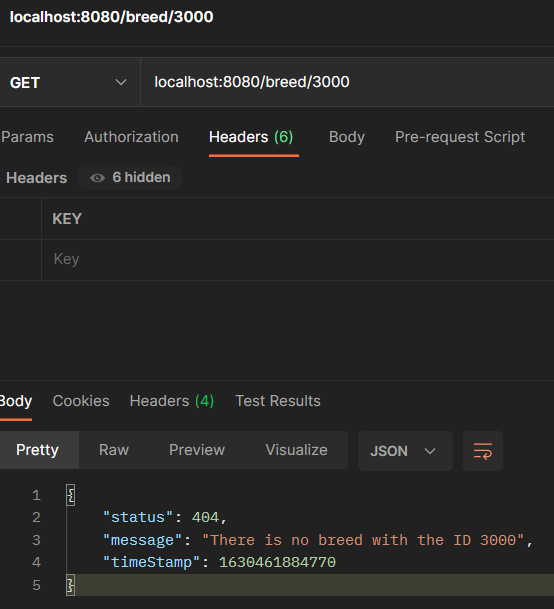

## Exception Handler

* This API implements a connection with Dog API which is free for personal purposes.
* In order to be able to use the free version of Dog API, visit this site (https://thedogapi.com/) and make your signup, then you should receive a KEY to make que requests by email.
* Copy the key and create a system variable in your computer called DOG_API_KEY with the value informed in the email.
* Now you can open the project and run to test it (In case you IDE was open, close and open it again to refresh the system variables)
* With this API you can search for dog breed by its id, and it has an exception handler using Micronaut and Kotlin, so when a breed id is not found, it should return something like this:

